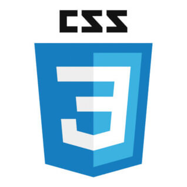
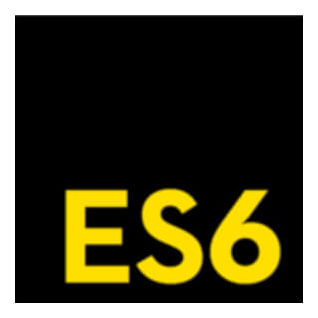
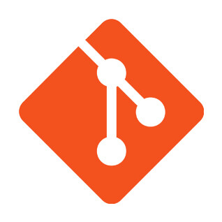
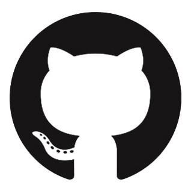

<h3>나의 GitHub 잔디 관리 </h3>

<h2> 안녕하세요! 꾸준함을 믿고 매일 매일 자기개발을 하며 프론트엔드 개발자가 되기위해 노력하는 제 이름은 이현기입니다. 👋

 <h3> 👨🏻‍💻 About Me </h3>
- 🔭 &nbsp; 저는 현재 프론트엔드 개발자가 되기위해 준비하고 있습니다. 
- 🎓 &nbsp; 자료구조와 알고리즘 공부를 틈틈이 하고 있습니다. 
- 🤔 &nbsp; 항상 새로운 기술과 개발에 필요한 지식을 쌓기 위해 자기개발을 하고 있습니다. 
- 🤔 &nbsp; 웹 표준과 접근성을 고려해서 개발하는 개발자가 되기위해 노력을 하고 있습니다. 
- 👨 &nbsp; TDD(Test-Driven Development)방식을 지향하는 개발자가 되기위해 노력합니다. 
- 🤔 &nbsp; 항상 새로운 기술과 개발에 필요한 지식을 쌓기 위해 자기개발을 하며 공부한 내용은 블로그에 포스팅을 하고 있습니다. 
- 🎓 &nbsp; 단순 코더가 아닌 컴퓨팅 사고를 할 수 있는 찐 개발자가 되기 위해 노력하고 있습니다. 

 
<h3>🛠 Tech Stack</h3>

- 💻 &nbsp; Python   

- 🌐 &nbsp; HTML  | CSS | JavaScript | TypeScript  | ReactJS  
- 🛢 &nbsp; MongoDB  | MySQL  
- 🔧 &nbsp; Visual Studio code  | Git GitHub

 

 
